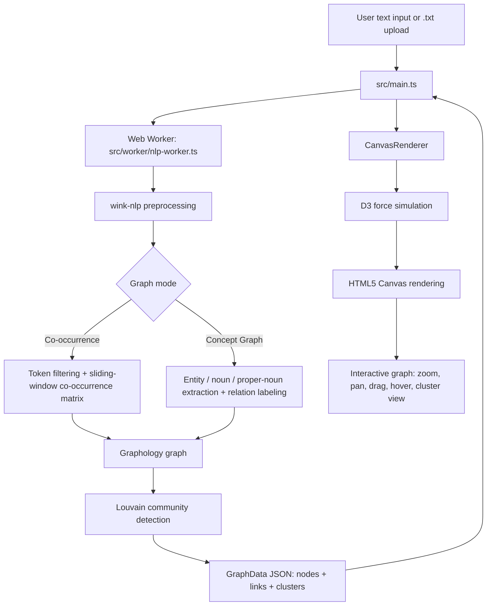

# Online Force-Directed Graph

## One-line summary

Browser-based NLP graph visualizer that converts plain text into interactive force-directed co-occurrence and concept graphs using client-side TypeScript, Web Workers, D3.js, and Canvas rendering.

## Demo

Live demo:

[https://online-force-directed-graph.vercel.app/](https://online-force-directed-graph.vercel.app/)

Basic workflow:

1. Open the demo or run the app locally.
2. Paste text into the text area or upload a `.txt` file.
3. Choose either **Co-occurrence** or **Concept Graph** mode.
4. Select a split method:
   - **Sentence Split**
   - **Block Split** using empty lines
5. Choose the maximum number of nodes to display.
6. Click **Process & Visualize**.
7. Explore the graph with zoom, pan, hover, node dragging, clustering, and physics controls.

Available UI controls:

| Control | Purpose |
|---|---|
| Co-occurrence / Concept Graph tabs | Switch between word-neighborhood graphing and concept/entity graphing |
| Text upload | Load `.txt` files directly in the browser |
| Find and Replace | Clean or normalize text before visualization |
| Max Nodes | Limit graph size to 50, 100, 200, 500, or 1000 nodes |
| Cluster | Toggle community-based node coloring |
| Show Node Info | Display hovered-node details and top neighbors |
| Cluster Pull | Adjust how strongly communities are pulled together |
| Global Gravity | Adjust global force-simulation gravity |
| Stress Test | Render a generated 5,000-node graph for performance testing |

## Screenshots

No screenshots are currently committed to the repository.

Recommended screenshots to add:

```markdown


```

## Problem

Large text documents are difficult to inspect using only raw text, keyword search, or frequency counts. Frequency alone shows which words occur often, but not how terms relate to each other, which concepts appear together, or which topics form natural clusters.

The project addresses this by turning text into an interactive graph that helps users explore:

- repeated terms
- local word relationships
- extracted concepts and entities
- relation labels between concepts
- community structure in the text
- important neighbors around a selected node

## Solution

Online Force-Directed Graph is a fully client-side text-to-graph visualizer.

The app processes input text in a Web Worker, builds either a co-occurrence graph or concept graph, detects communities with Louvain clustering, and renders the result on an HTML5 Canvas using D3 force simulation.

Two graph modes are supported:

| Mode | What it builds | Best for |
|---|---|---|
| Co-occurrence Graph | Connects meaningful words that appear near each other within a sliding window | Exploring repeated term neighborhoods |
| Concept Graph | Extracts entities, nouns, and proper nouns, then links concepts that appear in the same chunk | Exploring higher-level concepts and relations |

The rendering path is optimized for larger graphs by using Canvas instead of SVG DOM nodes. NLP and graph construction are moved off the main UI thread to keep the interface responsive during heavier text processing.

## Tech stack

| Area | Tools |
|---|---|
| Language | TypeScript |
| Build tool | Vite |
| Visualization | D3.js force simulation |
| Rendering | HTML5 Canvas |
| Background processing | Web Workers |
| NLP | wink-nlp, wink-eng-lite-web-model |
| Graph data structure | Graphology |
| Community detection | graphology-communities-louvain |
| UI | HTML, CSS, browser DOM APIs |
| Deployment | Vercel |
| License | Apache-2.0 |

## Architecture



Source layout:

```text
.
├── index.html
├── package.json
├── src
│   ├── main.ts
│   ├── style.css
│   ├── renderer
│   │   └── canvas-renderer.ts
│   └── worker
│       └── nlp-worker.ts
├── public
│   ├── favicon.svg
│   └── icons.svg
└── openspec
    ├── specs
    │   ├── canvas-graph-renderer
    │   └── worker-nlp-engine
    └── changes
```

Runtime responsibilities:

| Component | Responsibility |
|---|---|
| `index.html` | Defines the app shell, controls, graph canvas, and node-info panel |
| `src/main.ts` | Handles UI state, file upload, find/replace, graph-mode switching, worker messaging, and renderer updates |
| `src/worker/nlp-worker.ts` | Performs NLP preprocessing, token/concept extraction, co-occurrence calculation, graph construction, and Louvain clustering |
| `src/renderer/canvas-renderer.ts` | Renders graph nodes/links on Canvas and manages zoom, pan, dragging, hover detection, highlighting, labels, and physics settings |
| `src/style.css` | Styles the graph workspace, controls, panels, and responsive UI |
| `openspec/` | Stores implementation specs and change notes for major features |

## How to run locally

### Prerequisites

- Node.js
- npm

### Install

```bash
git clone https://github.com/somerandomguy-coder/online-force-directed-graph.git
cd online-force-directed-graph
npm install
```

### Start development server

```bash
npm run dev
```

Then open the local Vite URL shown in the terminal, commonly:

```text
http://localhost:5173/
```

### Build for production

```bash
npm run build
```

This runs TypeScript checking and creates the production build.

### Preview production build

```bash
npm run preview
```

## Tests

There is no automated test script currently defined in `package.json`.

Current validation path:

```bash
npm run build
```

Manual smoke-test checklist:

- Paste a medium-sized text sample and process it in **Co-occurrence** mode.
- Switch to **Concept Graph** mode and verify the graph regenerates.
- Upload a `.txt` file and confirm the graph is generated.
- Toggle **Cluster** and verify nodes are color-grouped.
- Hover over nodes and verify top neighbors appear in the node-info panel.
- Change **Max Nodes** and verify the graph reprocesses.
- Adjust **Cluster Pull** and **Global Gravity** and verify physics behavior changes.
- Run the **Stress Test (5k nodes)** button and verify the UI remains usable.

Recommended automated tests to add:

- unit tests for token filtering and stop-word removal
- unit tests for sentence/block splitting
- unit tests for co-occurrence matrix generation
- unit tests for concept extraction and relation-label selection
- worker message contract tests
- renderer smoke tests for graph-data ingestion
- Playwright end-to-end tests for upload, process, hover, and clustering flows

## Key technical decisions

- **Canvas instead of SVG:** graph nodes and links are drawn directly to HTML5 Canvas to avoid creating thousands of SVG DOM elements.
- **Web Worker for NLP and graph construction:** tokenization, cleaning, co-occurrence matrix generation, and concept extraction run off the main thread.
- **D3 for physics, not DOM rendering:** D3 force simulation handles layout, while custom Canvas drawing handles rendering.
- **Graphology for graph operations:** graph construction and community detection use a dedicated graph library instead of ad-hoc data structures only.
- **Louvain clustering:** communities are computed so users can visually group related terms and concepts.
- **Two graph modes:** co-occurrence mode supports low-level term-neighborhood analysis; concept mode supports higher-level semantic exploration.
- **Sentence/block split options:** users can control whether relationships are formed at sentence level or paragraph/block level.
- **Node limits:** large documents can be reduced to the most frequent concepts/terms to control visual clutter and browser workload.
- **Interactive inspection:** hover highlighting, neighbor lists, zoom, pan, drag, and dynamic labels make the graph explorable rather than static.
- **Client-side only design:** text processing happens in the browser; no backend service is required for the core workflow.

## Results / metrics

Current repository status:

| Category | Status |
|---|---|
| Live demo | Deployed on Vercel |
| Co-occurrence graph mode | Implemented |
| Concept graph mode | Implemented |
| Text upload | Implemented for `.txt` files |
| Find and replace | Implemented |
| Louvain clustering | Implemented |
| Canvas-based renderer | Implemented |
| Web Worker NLP processing | Implemented |
| Node hover / neighbor panel | Implemented |
| Physics controls | Implemented |
| Built-in stress test | Implemented for 5,000 generated nodes |
| Automated test suite | Not implemented |
| CI pipeline | Not documented |
| Formal performance benchmark | Not documented |
| Screenshots | Not committed |

OpenSpec targets documented in the repository:

| Target | Status |
|---|---|
| Render 5,000 nodes using Canvas | Specified and supported by the stress-test workflow |
| Maintain above 30 FPS during 5,000-node physics simulation | Stated as a design target; measured benchmark results are not currently published |
| Process a 5 MB text blob in a Web Worker while keeping the main thread responsive | Stated as a design target; measured benchmark results are not currently published |

## Limitations

- The NLP pipeline is English-oriented because it uses an English wink-nlp model.
- Relation labels in concept mode are heuristic and based on nearby verbs; they should not be treated as fully reliable semantic relations.
- Large files are still limited by browser CPU and memory.
- The app currently supports `.txt` upload, not PDF, DOCX, Markdown, CSV, or direct URL ingestion.
- Graph quality depends heavily on text cleanliness, stop-word filtering, split method, and max-node setting.
- Dense graphs can become visually cluttered even with Canvas rendering.
- There is no automated test suite yet.
- There is no documented benchmark for FPS, memory usage, or processing latency.
- Graph export, persistence, and shareable project files are not implemented yet.
- The app is single-user and client-side only; there is no backend storage, account system, or collaboration layer.

## Roadmap

- Add screenshots and a short demo GIF to the README.
- Add benchmark results for 1k, 5k, and 10k node rendering.
- Add automated tests for worker graph generation and UI workflows.
- Add CI to run TypeScript build and tests on pull requests.
- Add export options for PNG, SVG, and graph JSON.
- Add import support for Markdown and CSV.
- Add saved sessions using local storage or downloadable project files.
- Add search/filter controls for nodes and links.
- Add configurable stop-word lists.
- Add graph-statistics panel for node count, edge count, density, and top communities.
- Improve concept relation extraction beyond simple verb heuristics.
- Add sample text datasets for quick demos.

## My role

I built the client-side text-to-graph application, including the TypeScript/Vite project setup, text ingestion UI, `.txt` upload flow, find-and-replace tooling, Web Worker NLP pipeline, co-occurrence graph generation, concept graph generation, Louvain community clustering, D3 force simulation integration, Canvas-based graph renderer, interaction model, physics controls, node-info panel, and Vercel deployment workflow.
